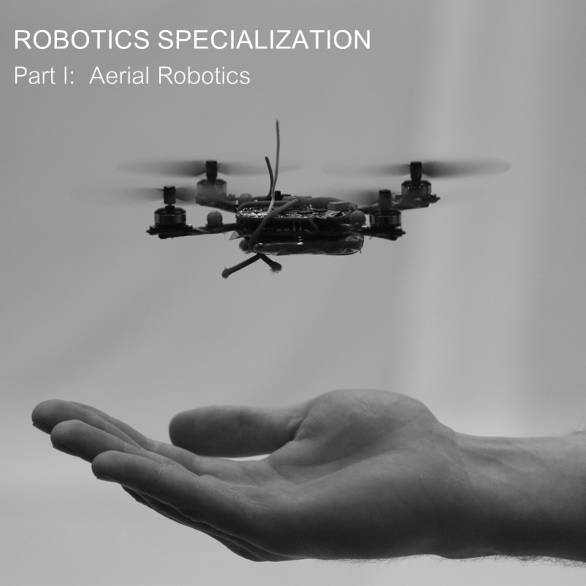

# Coursera : Penn - Robotics: Aerial Robotics

This folder contains codes to the [Aerial Robotics](https://www.coursera.org/learn/robotics-flight) course by Vijay Kumar. 

According to the description presented in the web site:

> How can we create agile micro aerial vehicles that are able to operate autonomously in cluttered indoor and outdoor environments?  You will gain an introduction to the mechanics of flight and the design of quadrotor flying robots and will be able to develop dynamic models, derive controllers, and synthesize planners for operating in three dimensional environments.  You will be exposed to the challenges of using noisy sensors for localization and maneuvering in complex, three-dimensional environments.  Finally, you will gain insights through seeing real world examples of the possible applications and challenges for the rapidly-growing drone industry.
> 
> Mathematical prerequisites: Students taking this course are expected to have some familiarity with linear algebra, single variable calculus, and differential equations.
> 
> Programming prerequisites: Some experience programming with MATLAB or Octave is recommended (we will use MATLAB in this course.) MATLAB will require the use of a 64-bit computer.
